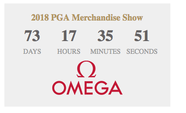

# Omega Clock Countdown
For use by PGA Sections only.

Provides countdown clock to the PGA Merchandise Show in 2018.

Implementation steps will vary slightly depending on each individual Section's website and where the Countdown Clock will be placed.

1. The styles.css fill will need to be uploaded into an appropriate area of the site and linked to correctly.  If there are naming conflicts, may be better to rename it to styles-clock-2018.css.  Alternatively the code for styles from styles.css can be copied into an existing style sheet on the website.

2. This Clock widget requres jQuery version 1.7 or higher to be present on the website. Has been tested with 1.12.4, later versions may introduce breaking changes.  Find out if the website already has jQuery, if not then either add a link to it from a CDN or ideally locally. If jQuery is already present on the page and it's a correct version, then it should not be included a 2nd time, that causes problems.

3. If there is no existing "ready" block, then the code for Calling the Countdown Clock Script can be added as is. If the webpage already has a jQuery "ready" block, then the code should be added inside of it.

4. Only the div pga-countdown and code inside of it is needed to be moved to the mark-up area of the Section site.

Also there you can use an iFrame embed option, here is an example:
[iframe example](https://pgahq.github.io/merchandise_show_clock/iframe.html)

